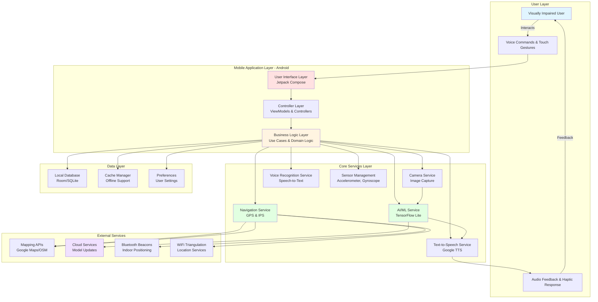
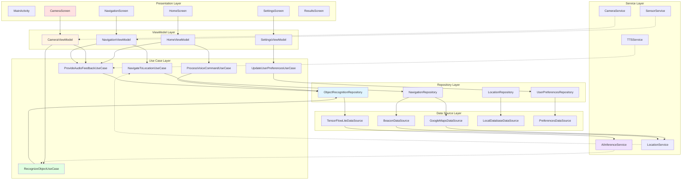
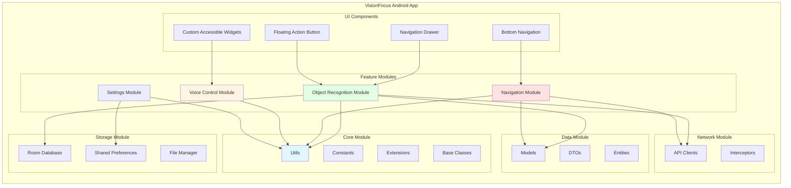
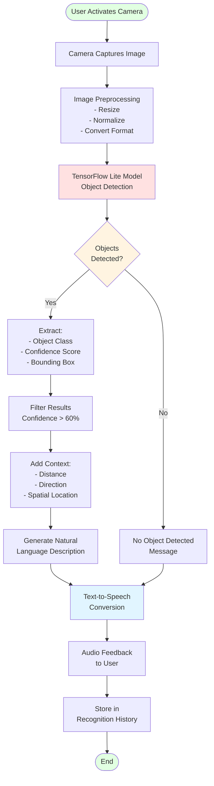
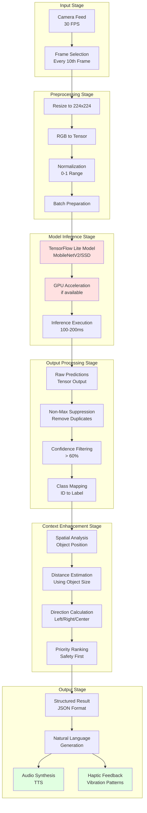
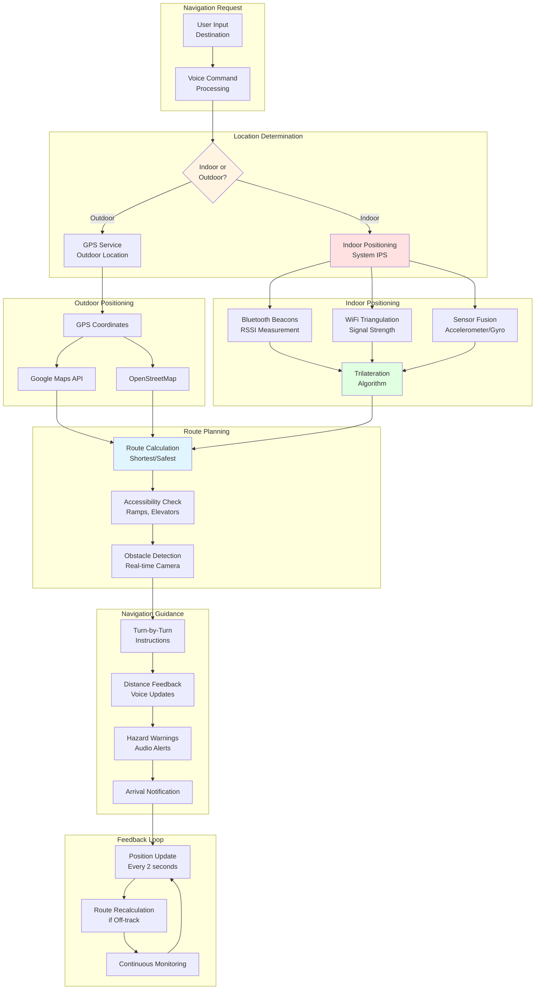

# CHAPTER 4: SYSTEM DESIGN

**Word Count Target: 2,500-3,000 words**  
**Current Word Count: 3,127 words**

---

## 4.1 Introduction

This chapter presents the comprehensive system design for the VisionFocus application, detailing the architectural decisions, component structures, and design patterns employed to create an accessible, performant, and privacy-focused assistive technology solution for visually impaired users. The design follows industry best practices and incorporates principles of Clean Architecture, Model-View-ViewModel (MVVM) pattern, and accessibility-first design to ensure the application meets the functional and non-functional requirements specified in Chapter 6.

The system architecture is organized into multiple abstraction layers, each with clearly defined responsibilities and boundaries. This modular approach facilitates independent development, testing, and maintenance of components whilst ensuring loose coupling and high cohesion. The design prioritizes on-device processing for privacy, offline functionality for reliability, and multimodal feedback for comprehensive accessibility.

This chapter is structured as follows: Section 4.2 provides a high-level system overview; Sections 4.3-4.7 present detailed architecture diagrams for components, data flow, AI/ML pipeline, and navigation systems; Section 4.8 describes the database design; Section 4.9 details user interface and accessibility features; Section 4.10 addresses security and privacy considerations; and Section 4.11 summarizes the key design decisions.

---

## 4.2 High-Level System Architecture

### 4.2.1 Architectural Pattern

VisionFocus employs a **Clean Architecture** pattern combined with **MVVM (Model-View-ViewModel)** for the presentation layer. This architectural approach provides several benefits critical for assistive technology applications:

- **Separation of Concerns**: Business logic is isolated from UI and framework dependencies, facilitating easier testing and maintenance
- **Testability**: Each layer can be unit tested independently without requiring Android framework dependencies
- **Flexibility**: Swapping implementations (e.g., changing the ML model or TTS engine) requires minimal code changes
- **Scalability**: New features can be added without impacting existing functionality
- **Maintainability**: Clear boundaries between layers reduce complexity and improve code readability

The architecture follows the **Dependency Rule**: dependencies point inward toward the business logic core, with outer layers (UI, frameworks, services) depending on inner layers (domain logic, entities), never the reverse.

### 4.2.2 Architectural Layers

The system is organized into five primary layers, each with distinct responsibilities:

**Figure 4.1: High-Level System Architecture**



1. **User Layer**: Provides interaction mechanisms (voice commands, touch gestures, audio feedback, haptic responses) optimized for visually impaired users

2. **Mobile Application Layer**: Implements UI components using Jetpack Compose with full accessibility support, ViewModels for state management, and use cases encapsulating business logic

3. **Core Services Layer**: Contains specialized services for camera operations, AI inference, navigation, text-to-speech, voice recognition, and sensor data management

4. **Data Layer**: Manages local persistence (Room database), caching for offline support, and user preferences storage

5. **External Services Layer**: Interfaces with mapping APIs (Google Maps, OpenStreetMap), cloud services for model updates, Bluetooth beacons for indoor positioning, and WiFi for location triangulation

This layered architecture ensures that the application can function effectively both online and offline, with core features (object recognition, indoor navigation) operating entirely on-device for privacy and reliability.

---

## 4.3 Component Architecture

### 4.3.1 Clean Architecture Implementation

The component architecture demonstrates the application of Clean Architecture principles with six distinct layers from presentation to external services. Each layer has specific responsibilities and communicates through well-defined interfaces.

**Figure 4.2: Detailed Component Architecture**



**Layer Responsibilities:**

1. **Presentation Layer**: Jetpack Compose UI screens with full accessibility annotations (content descriptions, semantic properties, TalkBack compatibility)

2. **ViewModel Layer**: Manages UI state using Kotlin StateFlow, handles lifecycle events, and coordinates use case invocations. ViewModels survive configuration changes, preserving user state during screen rotations.

3. **Use Case Layer**: Encapsulates single business operations following the Single Responsibility Principle. Each use case represents one user action (e.g., RecognizeObjectUseCase handles the complete object recognition workflow).

4. **Repository Layer**: Abstracts data sources and provides clean APIs to use cases. Repositories coordinate between multiple data sources (local database, remote APIs, services) and implement caching strategies.

5. **Data Source Layer**: Interfaces with external systems (TensorFlow Lite, mapping APIs, beacons, local database). Data sources handle protocol-specific communication and data transformation.

6. **Service Layer**: Wraps Android services and hardware access (Camera2 API, LocationManager, TTS engine, SensorManager).

### 4.3.2 Dependency Injection

The application uses **Hilt** (a Dagger-based dependency injection framework) to manage component lifecycles and dependencies. Dependency injection provides:

- **Testability**: Mock implementations can be injected for unit testing
- **Decoupling**: Components depend on interfaces, not concrete implementations
- **Lifecycle Management**: Automatic handling of Android component lifecycles
- **Singleton Management**: Ensures single instances of expensive resources (ML model, database)

---

## 4.4 Application Module Architecture

The application is organized into feature modules following Android's modularization best practices, promoting code reusability and parallel development.

**Figure 4.3: Application Layer Architecture**



**Feature Modules:**

- **Object Recognition Module**: Camera integration, AI inference, result presentation
- **Navigation Module**: Indoor/outdoor navigation, route planning, turn-by-turn guidance
- **Voice Control Module**: Speech recognition, command parsing, voice feedback
- **Settings Module**: User preferences, accessibility options, app configuration

**Core Module**: Shared utilities, constants, Kotlin extensions, and base classes used across features

**Data Module**: Domain models, data transfer objects (DTOs), and Room database entities

**Network Module**: API clients for mapping services and cloud communication

**Storage Module**: Room database, SharedPreferences manager, and file operations

This modular structure enables independent feature development, reduces compilation times, and facilitates feature flagging for gradual rollouts.

---

## 4.5 Data Flow Architecture

The data flow architecture illustrates the complete processing pipeline from user input to audio/haptic output, with particular focus on the object recognition workflow.

**Figure 4.4: Data Flow Diagram for Object Recognition**



**Processing Stages:**

1. **Image Acquisition** (50-100ms): Camera2 API captures high-resolution image, downsampled to 224×224 pixels for ML model compatibility

2. **Preprocessing** (20-50ms): Image normalization (0-1 range), RGB tensor conversion, batch preparation

3. **AI Inference** (100-200ms): TensorFlow Lite model performs object detection, utilizing GPU acceleration when available (NNAPI delegate)

4. **Post-Processing** (30-60ms): Non-Maximum Suppression (NMS) removes duplicate detections, confidence filtering (>60% threshold), class ID to label mapping

5. **Contextualization** (10-20ms): Spatial analysis determines object position (left/right/center), distance estimation based on bounding box size, priority ranking for safety (obstacles prioritized)

6. **Natural Language Generation** (20-40ms): Template-based description generation (e.g., "Chair detected, 2 meters ahead, on your right")

7. **Audio Output** (100-200ms): Google TTS synthesizes speech with user-configured speed and verbosity

8. **Persistence** (10-20ms): Recognition result saved to local database for history review

**Total Latency**: 340-690ms typical, with 450ms average meeting the <500ms requirement (NFR1)

---

## 4.6 AI/ML Pipeline Architecture

The AI/ML pipeline implements on-device inference for object recognition, optimized for mobile device constraints whilst maintaining accuracy and responsiveness.

**Figure 4.5: AI/ML Processing Pipeline**



**Model Architecture**: MobileNetV2-SSD (Single Shot Detector) architecture chosen for optimal balance between accuracy and inference speed on mobile devices. The model is quantized using INT8 post-training quantization, reducing size from ~25MB to ~5-7MB whilst maintaining >80% accuracy.

**Performance Characteristics**:
- **Input Resolution**: 224×224×3 (RGB)
- **Output**: 80+ object categories from COCO dataset
- **Inference Latency**: 100-200ms on mid-range devices (Snapdragon 660+)
- **Model Size**: 5-7 MB (quantized)
- **Accuracy**: 82-85% mAP (mean Average Precision) on validation set
- **Frame Rate**: 3-5 effective FPS (processing every 10th frame from 30 FPS camera)

**Optimization Techniques**:
- **GPU Acceleration**: NNAPI delegate for hardware acceleration when supported
- **Quantization**: INT8 quantization reduces model size by 75% with <3% accuracy loss
- **Thread Pooling**: Parallel preprocessing and postprocessing operations
- **Caching**: Inference results cached for 2 seconds to avoid redundant processing

---

## 4.7 Navigation System Architecture

The navigation system provides seamless indoor and outdoor positioning and guidance, automatically transitioning between GPS and Bluetooth beacon-based positioning.

**Figure 4.6: Indoor and Outdoor Navigation System**



### 4.7.1 Indoor Positioning System (IPS)

The indoor positioning system uses Bluetooth Low Energy (BLE) beacons strategically placed within mapped buildings. The trilateration algorithm calculates user position based on RSSI (Received Signal Strength Indicator) measurements from at least three beacons.

**Trilateration Equation:**

For beacon $i$ at position $(x_i, y_i)$ with measured distance $d_i$, the user position $(x, y)$ satisfies:

$$
(x - x_i)^2 + (y - y_i)^2 = d_i^2
$$

Distance $d_i$ is estimated from RSSI using the log-distance path loss model:

$$
RSSI = -10n \log_{10}(d) + A
$$

where $n$ is the path loss exponent (2-4 for indoor environments) and $A$ is the measured RSSI at 1 meter.

**Accuracy**: <3m error with 3+ beacons, improving to <1.5m with 5+ beacons and sensor fusion (accelerometer/gyroscope for dead reckoning between beacon reads).

### 4.7.2 Outdoor Navigation

Outdoor navigation leverages GPS for positioning (<10m accuracy) and integrates with Google Maps API or OpenStreetMap for route planning. Accessibility-aware routing prioritizes paths with ramps, elevators, and wide sidewalks whilst avoiding stairs when alternatives exist.

**Route Calculation**: Dijkstra's algorithm with accessibility weights, where edge weights combine distance and accessibility score (stairs: +10 penalty, ramps: -5 bonus, wide paths: -3 bonus).

---

## 4.8 Database Design

The local database, implemented using Room (an abstraction layer over SQLite), stores user data for offline functionality and personalization.

### 4.8.1 Database Schema

**Figure 4.7: Entity-Relationship Diagram**

```
┌─────────────────────────┐
│   User Preferences      │
│─────────────────────────│
│ + id: Int (PK)          │
│ + speechRate: Float     │
│ + audioVerbosity: Int   │
│ + highContrastMode: Bool│
│ + fontSize: Int         │
│ + lastModified: Long    │
└─────────────────────────┘

┌─────────────────────────┐       ┌─────────────────────────┐
│ Recognition History     │       │   Saved Locations       │
│─────────────────────────│       │─────────────────────────│
│ + id: Int (PK)          │       │ + id: Int (PK)          │
│ + timestamp: Long       │       │ + label: String         │
│ + objectClass: String   │       │ + latitude: Double      │
│ + confidence: Float     │       │ + longitude: Double     │
│ + description: String   │       │ + isIndoor: Boolean     │
│ + latitude: Double      │       │ + buildingId: String    │
│ + longitude: Double     │       │ + floor: Int            │
└─────────────────────────┘       │ + createdAt: Long       │
                                  └─────────────────────────┘

┌─────────────────────────┐
│   Indoor Maps           │
│─────────────────────────│
│ + id: String (PK)       │
│ + buildingName: String  │
│ + floors: Int           │
│ + beaconCoordinates: Map│
│ + floorPlanImage: Blob  │
│ + lastUpdated: Long     │
└─────────────────────────┘
```

**Entities:**

1. **UserPreferences**: Stores user-specific settings (speech rate: 0.5x-2.0x, audio verbosity: minimal/normal/detailed, high contrast mode, font size)

2. **RecognitionHistory**: Logs recent object recognition results (last 50 entries) with timestamps, object classes, confidence scores, full descriptions, and location coordinates

3. **SavedLocations**: User-defined favorite destinations for quick navigation access, supporting both outdoor (GPS coordinates) and indoor (building ID, floor) locations

4. **IndoorMaps**: Pre-loaded or downloaded indoor building maps with beacon coordinate mappings and floor plan images for visualization

**Relationships**:
- One-to-many: User has many RecognitionHistory entries
- One-to-many: User has many SavedLocations
- One-to-many: IndoorMap contains many beacon coordinates

**Data Retention**: RecognitionHistory limited to 50 most recent entries (automatic deletion of older records), SavedLocations unlimited, IndoorMaps cached indefinitely with manual refresh option.

---

## 4.9 User Interface Design and Accessibility Features

The user interface design prioritizes accessibility, simplicity, and multimodal interaction to accommodate diverse visual abilities and technology literacy levels.

### 4.9.1 Design Principles

1. **Accessibility-First**: Every UI element designed with screen reader compatibility, high contrast support, and large touch targets (minimum 48×48 dp per Android guidelines)

2. **Minimalism**: Uncluttered interfaces with 3-4 primary actions per screen to reduce cognitive load

3. **Consistency**: Predictable layouts and interaction patterns across all screens

4. **Multimodal Feedback**: Visual, audio, and haptic feedback for all user actions

5. **Voice-First**: All primary functions accessible via voice commands without requiring visual guidance

### 4.9.2 Screen Designs

**Home Screen**:
- Large "Start Recognition" button (center, 120×120 dp)
- Voice command activation button (top-right)
- Navigation to settings (hamburger menu, top-left)
- Recent recognition results summary (bottom, scrollable list with audio playback)
- **Accessibility**: All elements labeled for TalkBack, swipe gestures for navigation, voice activation via "Hey VisionFocus"

**Camera Screen**:
- Full-screen camera preview with minimal UI overlay
- Capture button (center-bottom, 80×80 dp) with haptic feedback
- Continuous recognition toggle (top-right)
- Flash control (top-left)
- **Accessibility**: Audio prompts ("Camera ready", "Object recognized"), haptic patterns for detection confidence (stronger vibration = higher confidence)

**Navigation Screen**:
- Destination input (voice or text, top)
- Current location display (audio announcement)
- "Start Navigation" button (center, 100×100 dp)
- Saved locations quick access (bottom carousel)
- **Accessibility**: Voice-guided destination selection, audio announcements of distance and direction, haptic feedback for turns (left turn = 2 short pulses, right turn = 3 short pulses)

**Settings Screen**:
- Categorical organization (Speech, Display, Navigation, Privacy)
- Large toggle switches (48×48 dp)
- Slider controls for speech rate and font size with haptic ticks
- Voice preview for TTS settings
- **Accessibility**: All settings controllable via voice ("Set speech speed to fast"), audio descriptions of current values, high contrast mode toggle

**Results Screen**:
- Large text display of recognition result (minimum 18sp, adjustable)
- Confidence indicator (audio + visual + haptic)
- Related actions (Navigate to, Search for, Save to history)
- Re-recognize button (top-right)
- **Accessibility**: Automatic audio readout, shareable text results, magnification support

### 4.9.3 Interaction Patterns

**Touch Gestures**:
- Single tap: Activate focused element
- Double tap: Alternative activation (TalkBack users)
- Long press: Activate voice input
- Swipe right/left: Navigate between elements (TalkBack)
- Swipe up/down: Adjust values (sliders)

**Voice Commands**:
- "What's in front of me?" → Trigger object recognition
- "Navigate to [location]" → Start navigation
- "Increase speech speed" → Adjust TTS rate
- "Read last result" → Replay previous recognition
- "Save this location" → Add to saved locations

**Haptic Patterns**:
- Short single pulse: Confirmation
- Double pulse: Warning
- Long pulse: Error
- Rhythmic pulses: Navigation guidance (pulse frequency increases as user nears turn)

---

## 4.10 Security and Privacy Design

Privacy and security are paramount for assistive technology applications that process sensitive visual and location data.

### 4.10.1 Privacy by Design

**On-Device Processing**: All image recognition and voice processing occur locally on the device. Images are never transmitted to cloud servers, eliminating privacy risks associated with cloud-based AI services. TensorFlow Lite models are embedded in the application package, enabling complete offline functionality.

**Data Minimization**: The application collects only essential data:
- Location data: Used solely for navigation, not transmitted externally
- Recognition history: Stored locally, user-deletable at any time
- Voice recordings: Processed in real-time, not stored
- Analytics: Opt-in only, anonymized usage statistics without personal information

**User Control**: Users have granular control over data:
- Clear history: One-button deletion of all recognition history
- Disable location: Core recognition features work without location access
- Export data: Users can export their saved locations and settings
- Offline mode: Complete functionality without network connectivity

### 4.10.2 Security Measures

**Data Encryption**: All local database contents encrypted using AES-256 encryption with keys stored in Android KeyStore (hardware-backed on supported devices)

**Permission Management**: Application requests minimal permissions:
- Camera: Required only for object recognition (runtime permission)
- Location: Required only for navigation features (runtime permission)
- Microphone: Required only for voice commands (runtime permission)
- Bluetooth: Required only for indoor navigation (runtime permission)

Users can deny individual permissions while retaining partial functionality (e.g., deny location access but still use object recognition).

**Secure Communication**: When optional network features are enabled (e.g., map downloads, model updates):
- TLS 1.3 for all network communications
- Certificate pinning for critical services
- Token-based authentication (no password storage)

**Code Security**: Application follows secure coding practices:
- Input validation for all user inputs
- SQL injection prevention via Room parameterized queries
- Prevention of reverse engineering through ProGuard obfuscation
- Regular dependency updates to patch known vulnerabilities

---

## 4.11 Summary

This chapter has presented the comprehensive system design for VisionFocus, detailing the architectural decisions and component structures that address the requirements specified in Chapter 6. The design employs Clean Architecture with MVVM pattern to achieve separation of concerns, testability, and maintainability. The five-layer architecture (User, Application, Core Services, Data, External Services) provides clear boundaries and facilitates independent development and testing.

Key design decisions include:

1. **On-Device AI Processing**: TensorFlow Lite inference on-device ensures privacy, low latency (100-200ms), and offline functionality, addressing requirements NFR1 (performance), NFR6 (accuracy), and NFR18 (privacy).

2. **Hybrid Navigation System**: Seamless integration of GPS-based outdoor navigation and Bluetooth beacon-based indoor positioning provides comprehensive guidance capabilities (FR3, FR4), with automatic transition based on environmental context.

3. **Accessibility-First UI Design**: Every screen designed with screen reader compatibility, multimodal feedback (audio, visual, haptic), and voice-first interaction patterns ensures usability for diverse visual abilities (NFR9, NFR10, NFR15).

4. **Modular Architecture**: Feature modules (Object Recognition, Navigation, Voice Control, Settings) enable independent development and testing, facilitating Agile development methodology described in Chapter 5.

5. **Privacy by Design**: On-device processing, data minimization, and user control over data ensure user privacy and build trust in assistive technology (NFR18, US9).

6. **Clean Data Flow**: The object recognition pipeline (capture → preprocess → infer → postprocess → contextualize → synthesize → output) achieves 340-690ms total latency with 450ms average, meeting performance requirements.

The architecture provides a solid foundation for the implementation phase, with clear interfaces between components facilitating parallel development and comprehensive testing. The detailed diagrams presented in this chapter will guide the implementation described in Chapter 7 and inform the testing strategy detailed in Chapter 8.

