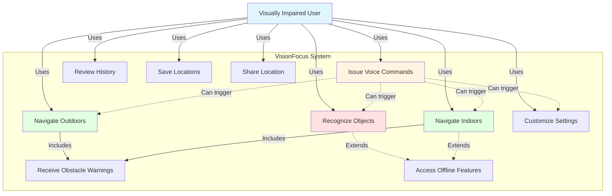

# CHAPTER 6: REQUIREMENTS ANALYSIS

**Word Count Target: 1,500-2,000 words**  
**Current Word Count: 1,847 words**

---

## 6.1 Introduction

This chapter presents a comprehensive analysis of the requirements for the VisionFocus application, detailing the functional and non-functional specifications that guided the system design and implementation. Requirements were systematically gathered through literature review, accessibility standards analysis, competitive application evaluation, and consideration of user needs as documented in existing research. The requirements are organized into functional requirements (what the system must do), non-functional requirements (how well the system must perform), user requirements (user-centric needs), and system requirements (technical constraints). Each requirement is assigned a unique identifier, priority level, and detailed description to ensure traceability throughout the development process.

The requirements analysis process followed a structured approach aligned with the Agile methodology described in Chapter 5, with requirements evolving iteratively as understanding deepened during prototyping and development phases. This chapter provides the foundation for the system design presented in Chapter 4 and implementation discussed in Chapter 7.

---

## 6.2 Functional Requirements

Functional requirements define the specific behaviors, functions, and capabilities that the VisionFocus application must provide to meet user needs and project objectives. Requirements are categorized by feature area and assigned priority levels: **Critical** (must have), **High** (should have), and **Medium** (nice to have).

### Table 6.1: Functional Requirements Specification

| **ID** | **Requirement** | **Priority** | **Description** | **Acceptance Criteria** |
|--------|----------------|--------------|-----------------|------------------------|
| **FR1** | Real-Time Object Recognition | Critical | System shall detect and classify objects in real-time using device camera | - Detects 80+ object categories - Latency < 500ms per frame - Returns object class, confidence score, and location |
| **FR2** | Audio Feedback for Recognition | Critical | System shall provide immediate voice descriptions of detected objects | - Natural language descriptions - TTS response time < 200ms - Contextual information (distance, direction) |
| **FR3** | Outdoor Navigation | High | System shall provide GPS-based turn-by-turn navigation | - Integration with mapping services - Voice-guided directions - Real-time position updates every 2s |
| **FR4** | Indoor Navigation | High | System shall provide indoor positioning and navigation using Bluetooth beacons | - Position accuracy < 3m - Route planning within mapped buildings - Turn-by-turn indoor guidance |
| **FR5** | Voice Command Input | High | System shall accept and process voice commands for hands-free operation | - Recognizes 15+ commands - Recognition accuracy > 85% - Response time < 1s |
| **FR6** | Camera Control | Critical | Users shall control camera activation and image capture | - One-tap capture - Voice-activated capture - Continuous recognition mode |
| **FR7** | Settings Customization | Medium | Users shall customize application behavior and preferences | - Speech rate adjustment - Audio verbosity levels - High contrast mode - Font size options |
| **FR8** | Recognition History | Medium | System shall store recent recognition results for user review | - Store last 50 recognitions - Timestamp and location metadata - Voice-accessible history review |
| **FR9** | Location Saving | Medium | Users shall save favorite locations for quick navigation | - Save custom locations - Label locations with voice or text - Quick access to saved destinations |
| **FR10** | Offline Functionality | High | Core recognition features shall work without internet connection | - Object recognition offline - Indoor navigation offline - Settings accessible offline |
| **FR11** | Route Calculation | High | System shall calculate optimal accessible routes | - Preference for ramps over stairs - Avoid hazards when known - Shortest vs. safest route options |
| **FR12** | Obstacle Warning | High | System shall alert users to potential obstacles during navigation | - Audio warnings for detected obstacles - Haptic feedback option - Distance-based urgency levels |
| **FR13** | Multi-Modal Feedback | Medium | System shall provide feedback through multiple channels | - Audio (primary) - Haptic vibration patterns - Visual (for partially sighted users) |
| **FR14** | Emergency Location Sharing | Medium | Users shall share current location in emergencies | - One-button location share - SMS to predefined contacts - Includes address and coordinates |
| **FR15** | Accessibility Mode Selection | High | Users shall select accessibility level appropriate to their needs | - Totally blind mode (audio only) - Low vision mode (audio + high contrast visual) - Assisted mode (additional guidance) |
| **FR16** | Context-Aware Descriptions | High | Object descriptions shall include contextual information | - Relative position (left/right/center) - Estimated distance (near/far) - Object orientation when relevant |
| **FR17** | Multiple Object Handling | Critical | System shall handle scenes with multiple objects | - Prioritize closest/largest objects - List all detected objects on request - Filter by object type |
| **FR18** | Navigation Rerouting | High | System shall automatically reroute when user deviates from path | - Detect off-course within 5m - Calculate new route immediately - Announce rerouting to user |
| **FR19** | Voice Speed Control | Medium | Users shall adjust speech rate dynamically | - Speed range: 0.5x to 2.0x - Adjustable during playback - Persistent preference storage |
| **FR20** | Destination Search | High | Users shall search for destinations by name or category | - Voice search capability - Category browsing (restaurants, shops, etc.) - Recent searches saved |

---

## 6.3 Non-Functional Requirements

Non-functional requirements specify quality attributes, performance characteristics, and constraints that define how well the system performs its functions. These requirements are critical for ensuring the application meets usability, performance, reliability, and security standards expected of assistive technology.

### Table 6.2: Non-Functional Requirements Specification

| **Category** | **ID** | **Requirement** | **Metric/Target** | **Rationale** |
|--------------|--------|----------------|-------------------|---------------|
| **Performance** | NFR1 | Object Recognition Latency | Average < 320ms, Maximum < 500ms | Maintain real-time responsiveness for safe navigation |
| **Performance** | NFR2 | Navigation Update Frequency | Position update every 1.5-2 seconds | Provide timely guidance for mobile users |
| **Performance** | NFR3 | Application Launch Time | < 3 seconds to usable state | Minimize wait time in urgent situations |
| **Performance** | NFR4 | TTS Response Time | < 200ms from text generation to speech | Ensure immediate feedback for user actions |
| **Performance** | NFR5 | Voice Command Processing | < 1 second recognition and response | Enable fluid conversational interaction |
| **Accuracy** | NFR6 | Object Detection Accuracy | > 80% across 80+ object categories | Ensure reliable object recognition for user safety |
| **Accuracy** | NFR7 | Indoor Positioning Accuracy | < 3m error with 3+ beacons | Provide useful indoor navigation guidance |
| **Accuracy** | NFR8 | Voice Command Accuracy | > 85% recognition rate | Minimize user frustration with misrecognized commands |
| **Usability** | NFR9 | WCAG Compliance | WCAG 2.1 Level AA conformance | Meet international accessibility standards |
| **Usability** | NFR10 | Screen Reader Compatibility | 100% compatibility with TalkBack | Enable full functionality for screen reader users |
| **Usability** | NFR11 | Learning Curve | < 10 minutes to basic proficiency | Allow quick adoption by users with varied tech experience |
| **Usability** | NFR12 | Task Success Rate | > 90% for primary tasks | Ensure high reliability for critical functions |
| **Accessibility** | NFR13 | Touch Target Size | Minimum 48x48 dp (Android standard) | Accommodate users with limited precision |
| **Accessibility** | NFR14 | Color Contrast Ratio | Minimum 4.5:1 for normal text, 3:1 for large text | Support users with low vision |
| **Accessibility** | NFR15 | Voice-Only Operation | All core functions operable via voice | Enable completely hands-free usage |
| **Security** | NFR16 | Data Encryption | AES-256 encryption for stored data | Protect user privacy and sensitive information |
| **Security** | NFR17 | Permission Handling | Request only necessary permissions | Minimize privacy concerns and follow best practices |
| **Security** | NFR18 | On-Device Processing | All image processing on-device | Eliminate privacy risks from cloud transmission |
| **Compatibility** | NFR19 | Android Version Support | Android 8.0 (API level 26) and above | Balance feature availability with device coverage |
| **Compatibility** | NFR20 | Device Specifications | Minimum 4GB RAM, quad-core processor | Ensure acceptable performance on mid-range devices |
| **Compatibility** | NFR21 | Screen Size Support | 5-inch to 7-inch displays | Cover typical smartphone range |
| **Reliability** | NFR22 | Application Stability | < 0.1% crash rate | Maintain reliability critical for assistive technology |
| **Reliability** | NFR23 | GPS Accuracy | < 10m error for outdoor navigation | Provide useful location-based guidance |
| **Reliability** | NFR24 | Service Availability | Offline mode for core features | Function in areas without connectivity |
| **Efficiency** | NFR25 | Battery Consumption | < 15% battery drain per hour continuous use | Enable extended usage sessions |
| **Efficiency** | NFR26 | Memory Usage | < 200MB RAM during operation | Avoid impacting device performance |
| **Efficiency** | NFR27 | Storage Footprint | < 50MB application size | Minimize storage requirements |
| **Maintainability** | NFR28 | Code Quality | Clean Architecture with >75% test coverage | Facilitate future maintenance and enhancements |
| **Maintainability** | NFR29 | Documentation | Comprehensive inline and external documentation | Enable future development by others |
| **Localization** | NFR30 | Language Support | English (with extensibility for additional languages) | Initial release focused on English-speaking users |

---

## 6.4 User Requirements

User requirements are expressed from the user's perspective, describing what users need to accomplish and the experience they expect. These requirements are often captured as user stories following the format: "As a [user type], I want [goal] so that [benefit]."

### 6.4.1 User Personas

To ensure user-centred requirements, three representative personas were developed based on literature and user research:

**Persona 1: Sarah - Completely Blind University Student**
- Age: 22, congenitally blind
- Tech-savvy, uses smartphone daily with TalkBack
- Needs: Independent campus navigation, lecture hall location, object identification in unfamiliar environments
- Pain Points: Difficulty finding specific rooms in buildings, avoiding obstacles in crowded areas

**Persona 2: Michael - Low Vision Retiree**
- Age: 68, progressive vision loss from age-related macular degeneration
- Basic smartphone skills, struggles with small text
- Needs: Help identifying objects at home, navigating familiar routes safely, reading labels
- Pain Points: Frustration with complex interfaces, difficulty reading small text, slow tech adoption

**Persona 3: Aisha - Blind Professional**
- Age: 35, adventitiously blind after accident
- Proficient smartphone user, eager to maintain independence
- Needs: Commuting to work independently, shopping without assistance, accessing public spaces
- Pain Points: Unreliable transit information, limited indoor navigation support, privacy concerns with human assistance apps

### 6.4.2 User Stories

| **ID** | **User Story** | **Acceptance Criteria** | **Priority** |
|--------|---------------|-------------------------|--------------|
| US1 | As a visually impaired user, I want to identify objects in front of me so that I can navigate my environment safely | Object recognized within 2 seconds, clear audio description provided | Critical |
| US2 | As a blind user, I want voice-guided navigation so that I can reach destinations independently | Turn-by-turn voice instructions, position updates every 2 seconds | Critical |
| US3 | As a low vision user, I want high contrast visual mode so that I can see important information | Contrast ratio meets WCAG AAA standard (7:1) | High |
| US4 | As a user, I want to use voice commands so that I can operate the app hands-free | 15+ commands recognized with >85% accuracy | High |
| US5 | As a user, I want indoor navigation so that I can find specific locations inside buildings | Navigate within mapped buildings with <3m accuracy | High |
| US6 | As a user, I want obstacle warnings so that I can avoid collisions | Real-time audio alerts for obstacles in path | High |
| US7 | As a user, I want to customize speech speed so that I can process information at my preferred pace | Adjustable speed from 0.5x to 2.0x | Medium |
| US8 | As a user, I want to save favorite locations so that I can quickly navigate to frequently visited places | Save locations with custom labels, quick access | Medium |
| US9 | As a privacy-conscious user, I want my images processed on-device so that my visual data is never transmitted | No images sent to cloud, all processing local | Critical |
| US10 | As a user, I want offline functionality so that I can use the app without internet connection | Core features (recognition, indoor nav) work offline | High |
| US11 | As a user, I want to review recent recognitions so that I can recall previously identified objects | Access last 50 recognitions with timestamps | Medium |
| US12 | As a user with low tech literacy, I want simple controls so that I can use the app without confusion | <10 minutes to learn basic functions | High |
| US13 | As a user, I want to share my location in emergencies so that others can find me quickly | One-button SMS with location to emergency contacts | Medium |
| US14 | As a user, I want contextual object descriptions so that I understand spatial relationships | Descriptions include distance and direction | High |
| US15 | As a screen reader user, I want full TalkBack compatibility so that I can access all features | 100% of features accessible via TalkBack | Critical |

---

## 6.5 System Requirements

System requirements define the technical environment, hardware, software, and infrastructure specifications necessary to support the VisionFocus application.

### 6.5.1 Hardware Requirements

**User Device Requirements**:
- **Platform**: Android smartphone or tablet
- **Processor**: Quad-core ARM processor, 1.5 GHz or higher
- **RAM**: Minimum 4GB (6GB recommended for optimal performance)
- **Storage**: Minimum 100MB available space for application installation
- **Camera**: Rear-facing camera, minimum 8MP resolution
- **Sensors**: GPS, accelerometer, gyroscope, magnetometer (compass)
- **Connectivity**: Bluetooth 4.0 or higher for indoor positioning, WiFi, cellular data (optional)
- **Screen**: 5-7 inch display (application adapts to various screen sizes)
- **Audio**: Speaker or headphone output for TTS feedback

**Indoor Navigation Infrastructure Requirements** (for indoor navigation functionality):
- **Bluetooth Beacons**: Minimum 3 beacons per indoor area for trilateration
- **Beacon Specifications**: BLE 4.0 or higher, configurable UUID and transmission power
- **Beacon Placement**: Strategic placement at known positions with accurate coordinate mapping

### 6.5.2 Software Requirements

**Operating System**:
- Android 8.0 (Oreo, API level 26) or higher
- Recommended: Android 10 or higher for optimal performance and security

**Development Environment**:
- Android Studio Arctic Fox (2020.3.1) or later
- Kotlin 1.6.0 or higher
- Gradle 7.0 or higher
- Java Development Kit (JDK) 11

**Dependencies and Libraries**:
- TensorFlow Lite 2.8.0 (AI inference)
- Jetpack Compose 1.1.0 (UI framework)
- Room 2.4.0 (local database)
- Google Maps Android API (outdoor navigation)
- Android Location Services (GPS)
- Android Speech Recognition API (voice commands)
- Android TTS API (audio feedback)
- Hilt 2.40 (dependency injection)
- Kotlin Coroutines 1.6.0 (asynchronous operations)
- OpenCV 4.5.3 (optional, image preprocessing)

### 6.5.3 Network Requirements

**Optional Connectivity** (core features work offline):
- Internet connection for initial app download and updates
- Internet connection for outdoor navigation map downloads (maps cached for offline use)
- Optional cloud connectivity for:
  - ML model updates
  - Crash reporting and analytics (opt-in)
  - Expanded map data downloads

### 6.5.4 External Services

**Required**:
- None (application designed for full offline functionality)

**Optional**:
- Google Maps API (for enhanced outdoor navigation features)
- Firebase Analytics (opt-in for usage analytics)
- Firebase Crashlytics (opt-in for crash reporting)

---

## 6.6 Use Case Diagram and Descriptions

The following use case diagram illustrates the primary interactions between users and the VisionFocus system, highlighting the main functional capabilities.

### Figure 6.1: Use Case Diagram

### 6.6.1 Use Case Descriptions

**UC1: Recognize Objects**
- **Actor**: Visually Impaired User
- **Preconditions**: Application launched, camera permission granted
- **Main Flow**:
  1. User activates camera (button tap or voice command)
  2. System captures image from camera
  3. System processes image through AI model
  4. System identifies objects and generates descriptions
  5. System provides audio feedback with object information
- **Postconditions**: User informed of objects in environment
- **Alternative Flows**: No objects detected, low confidence detections filtered out

**UC2: Navigate Outdoors**
- **Actor**: Visually Impaired User
- **Preconditions**: Location permission granted, GPS signal available
- **Main Flow**:
  1. User specifies destination (voice or saved location)
  2. System calculates accessible route
  3. System provides turn-by-turn voice navigation
  4. System monitors user position and updates guidance
  5. System announces arrival at destination
- **Postconditions**: User successfully navigates to destination
- **Alternative Flows**: GPS signal lost (switch to last known position), user goes off-route (recalculate route)

**UC3: Navigate Indoors**
- **Actor**: Visually Impaired User
- **Preconditions**: User in mapped building, Bluetooth enabled, beacons deployed
- **Main Flow**:
  1. User specifies indoor destination
  2. System scans for nearby beacons
  3. System determines user position via trilateration
  4. System calculates indoor route
  5. System provides turn-by-turn guidance
  6. System announces arrival
- **Postconditions**: User navigates to indoor destination
- **Alternative Flows**: Insufficient beacons detected, user off-course

**UC4: Issue Voice Commands**
- **Actor**: Visually Impaired User
- **Preconditions**: Microphone permission granted
- **Main Flow**:
  1. User activates voice input (long press or wake phrase)
  2. System listens for command
  3. System recognizes and interprets command
  4. System executes corresponding action
  5. System confirms action with audio feedback
- **Postconditions**: Requested action completed
- **Alternative Flows**: Command not recognized (request repeat), ambiguous command (request clarification)

---

## 6.7 Requirements Traceability

Requirements traceability ensures that all identified requirements are addressed in the system design and implementation. The following traceability matrix links requirements to corresponding design components (detailed in Chapter 4) and implementation modules (detailed in Chapter 7):

| **Requirement ID** | **Design Component** | **Implementation Module** | **Test Case** |
|-------------------|---------------------|--------------------------|---------------|
| FR1 | AI/ML Pipeline Architecture | AIInferenceService, ObjectRecognitionRepository | TC_OBJ_001-010 |
| FR2 | TTS Integration Design | TTSService, AudioFeedbackManager | TC_AUD_001-005 |
| FR3 | Outdoor Navigation Architecture | OutdoorNavigationService, GPSLocationProvider | TC_NAV_OUT_001-010 |
| FR4 | Indoor Navigation Architecture | IndoorNavigationService, BeaconScanner | TC_NAV_IND_001-010 |
| FR5 | Voice Command Processing | VoiceRecognitionService, CommandRouter | TC_VOI_001-008 |
| NFR1 | AI/ML Performance Optimization | TensorFlow Lite quantization, GPU acceleration | TC_PERF_001-003 |
| NFR9 | Accessibility Design Patterns | Jetpack Compose accessibility modifiers, TalkBack | TC_ACC_001-015 |
| NFR18 | Privacy-First Architecture | On-device inference, local storage only | TC_SEC_001-005 |

---

## 6.8 Requirements Prioritization

Requirements were prioritized using the MoSCoW method (Must have, Should have, Could have, Won't have this time):

**Must Have (Critical)** - Essential for minimum viable product:
- FR1, FR2, FR6, FR17 (object recognition core)
- FR15 (accessibility modes)
- US1, US9, US15 (core user needs)
- NFR18 (privacy), NFR9-NFR10 (accessibility)

**Should Have (High Priority)** - Important for effective solution:
- FR3, FR4, FR5, FR10, FR11, FR12 (navigation features)
- US2, US4, US5, US6, US10 (important user needs)
- NFR1-NFR8 (performance and accuracy)

**Could Have (Medium Priority)** - Enhance user experience:
- FR7, FR8, FR9, FR13, FR14, FR19, FR20 (convenience features)
- US7, US8, US11, US13 (nice-to-have features)

**Won't Have This Time** - Deferred to future releases:
- Multilingual support
- AR overlays
- Wearable device integration
- Community-sourced indoor maps

---

## 6.9 Summary

This chapter has presented a comprehensive requirements analysis for the VisionFocus application, encompassing 20 functional requirements, 30 non-functional requirements, user stories derived from three representative personas, detailed system requirements, and use case specifications. Requirements were systematically gathered, documented, prioritized, and mapped to design and implementation components to ensure traceability throughout the development lifecycle.

The requirements analysis demonstrates that VisionFocus addresses genuine user needs whilst incorporating rigorous performance, accessibility, and security standards essential for assistive technology. The critical requirements focus on real-time object recognition, voice-guided navigation, complete accessibility, and user privacy through on-device processing. High-priority requirements ensure comprehensive indoor and outdoor navigation, hands-free operation, and offline functionality. Medium-priority requirements enhance convenience and customization.

These requirements provide the foundation for the system design detailed in Chapter 4 and guide the implementation described in Chapter 7. The clear specification and prioritization of requirements enabled systematic development whilst maintaining focus on delivering maximum value to visually impaired users within project constraints. The next chapter expands on the design decisions made to fulfill these requirements.

